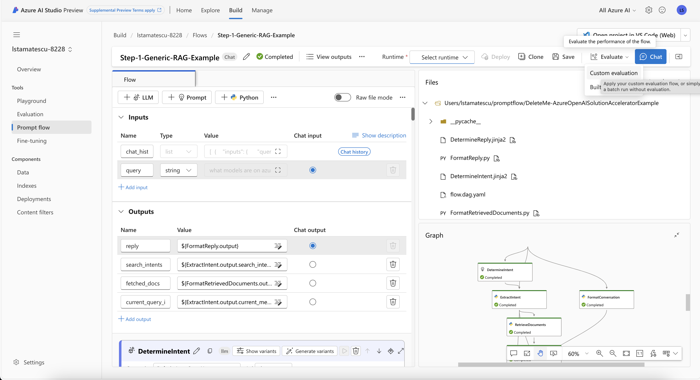
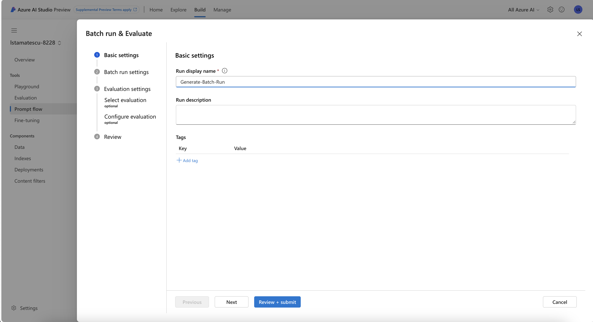
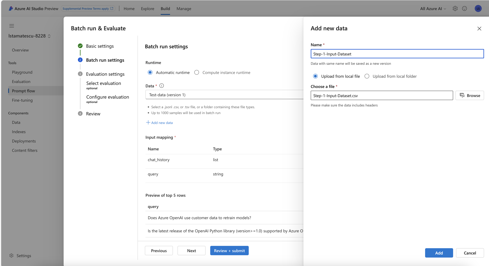
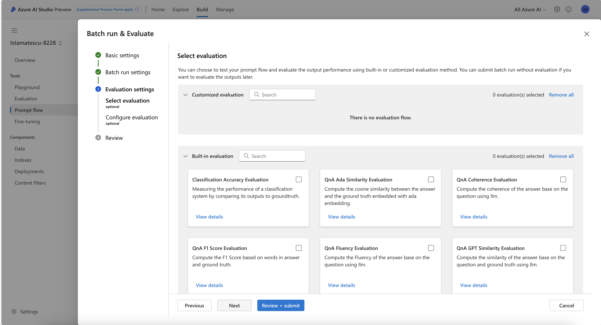
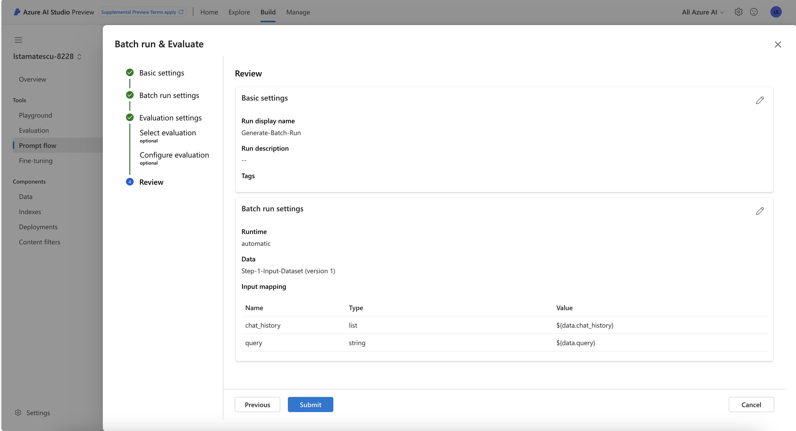
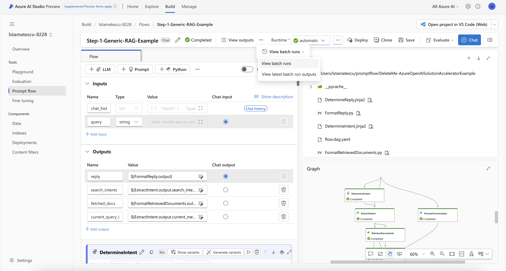
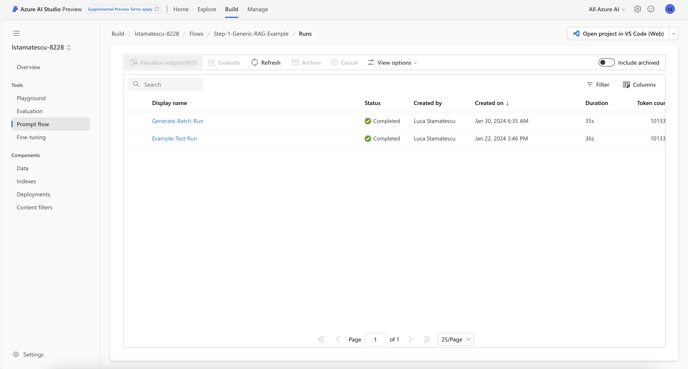
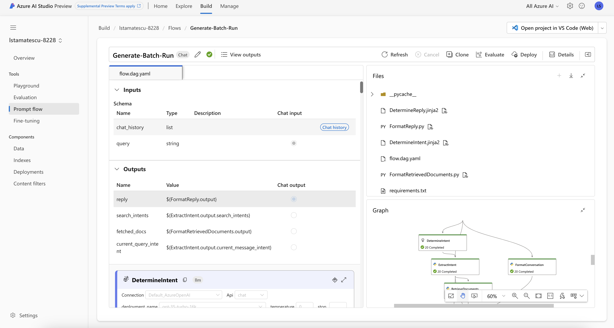
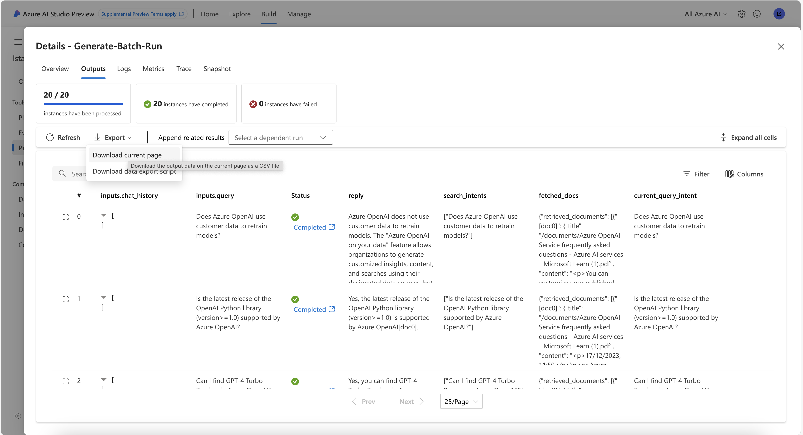

# Overview

In this section, we will demonstrate how to run a bulk evaluation of a PromptFlow. This step is important for generating the artefacts which will be used in evaluation metrics.

This is intended to be representative of any generic RAG application, and PromptFlow is not essential to this step. The RAG application can be treated as a black box, and as long as the required inputs and outputs can be logged to a file for use in later steps, the same outcome can be achieved.

# Instructions

- Open "Step-1-Generic-RAG-Example PromptFlow" in Azure AI Studio.
- In the top right, click Evaluate -> Custom Evaluation.

- Give any name to your flow, such as "Generate-Batch-Run". Click Next.

- Upload an input CSV file containing the queries and chat history for your use case. An example is included in "./Data/Step-1-Input-Dataset.csv". Click Next.

- If the column names match the PromptFlow inputs, they will be automatically mapped, otherwise perform the mapping manually. Click Next.

- Ensure no evaluation flows are selected. These will be evaluated in a separate step, to ensure our application is decoupled from the PromptFlow evaluation. Click Review + Submit to naviagte to the end.

- Click Submit.

- Open "Step-1-Generic-RAG-Example PromptFlow" in Azure AI Studio.
- In the middle of the top bar, click the ... -> View Batch Runs -> View Batch Runs.

- Click the name of the batch run you defined.

- Click "View Outputs" in the middle of the top bar.

- Click Export -> Download Current Page

The output should look similar to ".Data/Step-1-Expected-Output.csv"