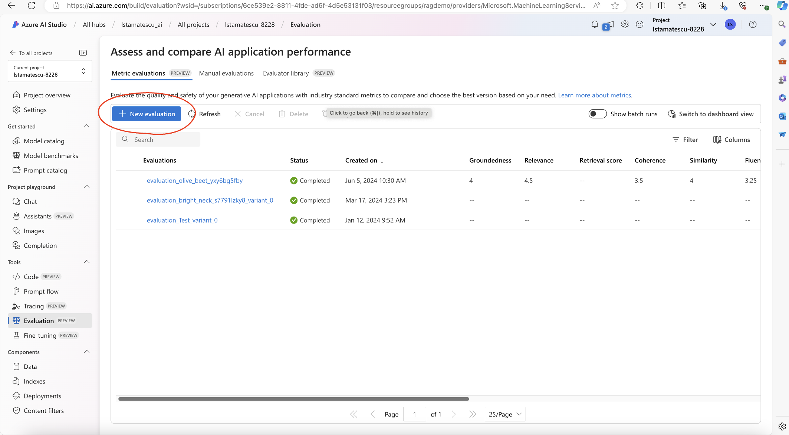
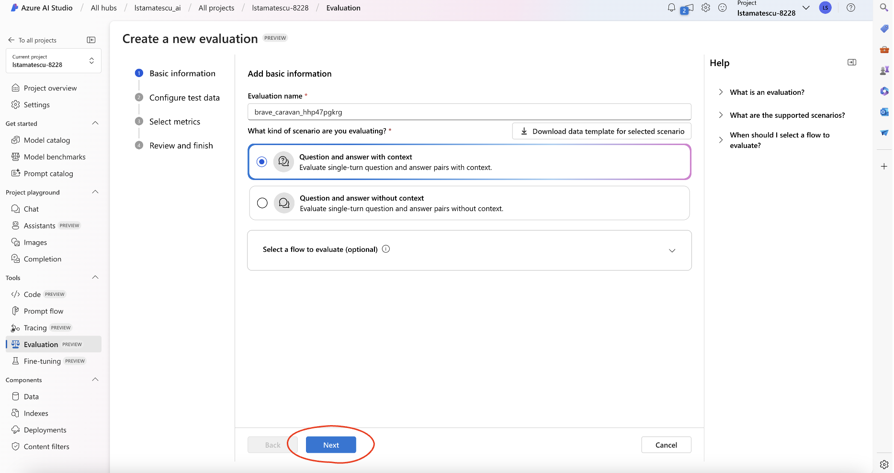
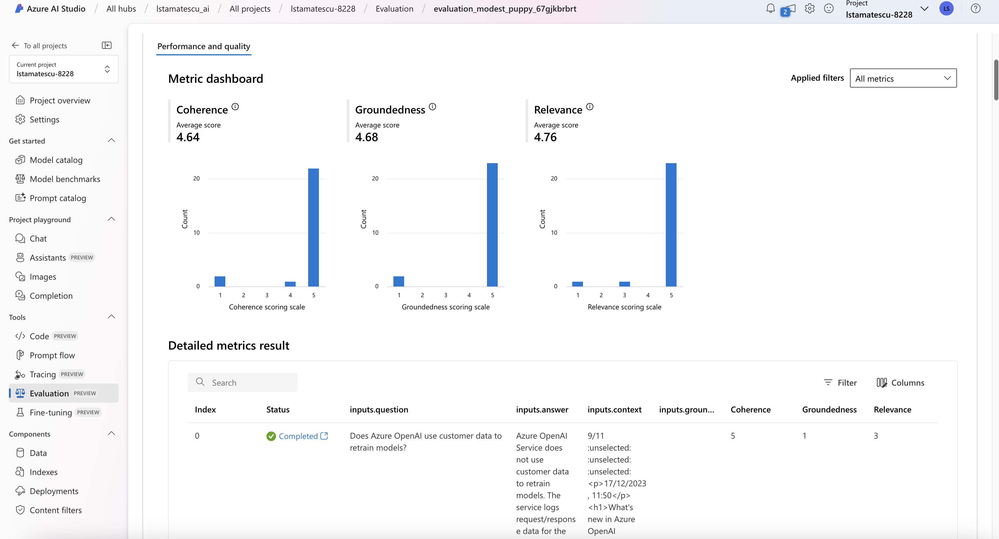

# Out-of-the-box evaluations with Azure AI Studio

## Overview

Azure AI Studio provides out-of-the-box LLM evaluation tooling. At the time of writing, this includes Groundedness, Relevance, Coherence, Fluency, GPT Similarity and the F1 Score. There are also metrics relating to Content Safety.

## Pre-work

The datasets created by the SME and the Artefact Logging steps should be combined. An example template CSV is included in this step, to show what the input should look like. The headings used in the input template are important, as they will allow the columns to be automatically mapped to the right input. This can be done when running the evaluation manually, but this approach is much simpler to manage.

## Instructions

- In Azure AI Studio, click the top right, click Evaluation in the sidebar.
- Choose "+ New evaluation"

- Select "Question and answer with context" as this is a RAG application.
- Click next.

- Upload the input CSV from this step, or upload your own file that follows the same structure and uses the same column names.
- Note: the preview of the dataset may look strange, due to new line characters in the context documents included in this workshop. This can be ignored, it will run correctly.
- Click next.

- Once the evaluation completes, you are able to see the calculated metrics, as both a bar chart and a table.
- Explore the examples that receive a low score- what could the reasons for this have been? These insights will help you better understand what components of your GenAI application need further improvement.

