# Custom Evaluation Metrics with PromptFlow and Azure AI Studio

## Overview

This part of the workshop shows how to implement custom LLM evaluation metrics. In this step, we go beyond the default metrics, adding in:
- The ability to add a "reason" field, which allows developers to understand the LLMs reason for giving a specific score. This is helpful for debugging and improving the application.
- Additional evaluation metrics, such as the tool_selection and GPT_retrieval/analytical_retrieval metrics. These extend the evaluation capability, providing a confusion matrix for actions the LLM takes, such as deciding what tool to call (e.g. a knowledgebase vs a SQL database) as well as metrics to evaluate the performance of the retrieval tasks (determining whether the retrieved documents match the ground truth documents).

## Pre-work

The datasets created by the SME and the Artefact Logging steps should be combined. An example template CSV is included in this step, to show what the input should look like. The headings used in the input template are important, as they will allow the columns to be automatically mapped to the right input. This can be done when running the evaluation manually, but this approach is much simpler to manage.

## Setup

- Select "Prompt Flow" in the sidebar.
- Click "+ Create".

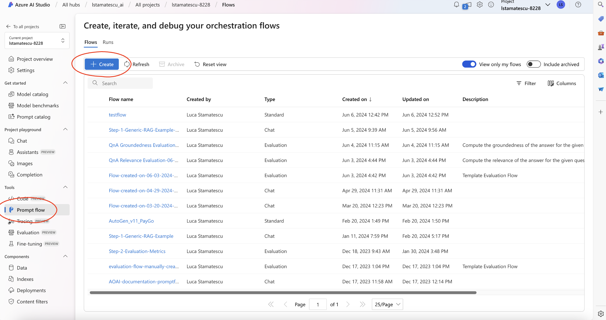

- Scroll down to see "Upload from local".
- Click Upload.

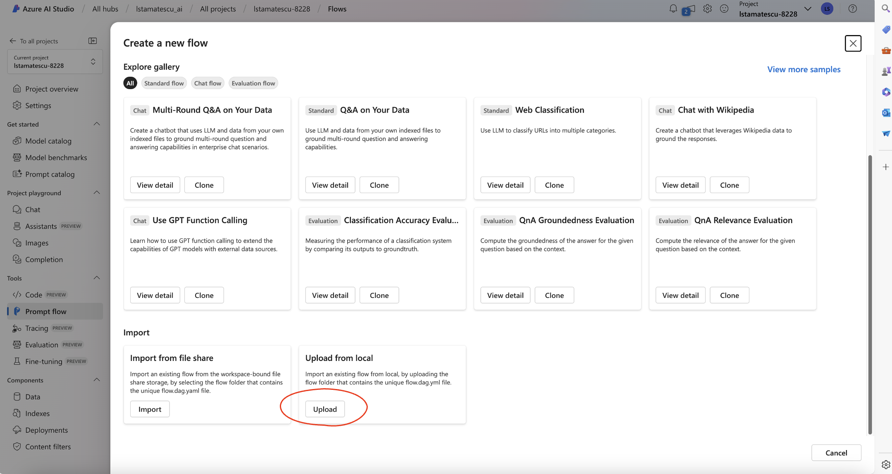

- Ensure Folder is selected.
- Click Browse.

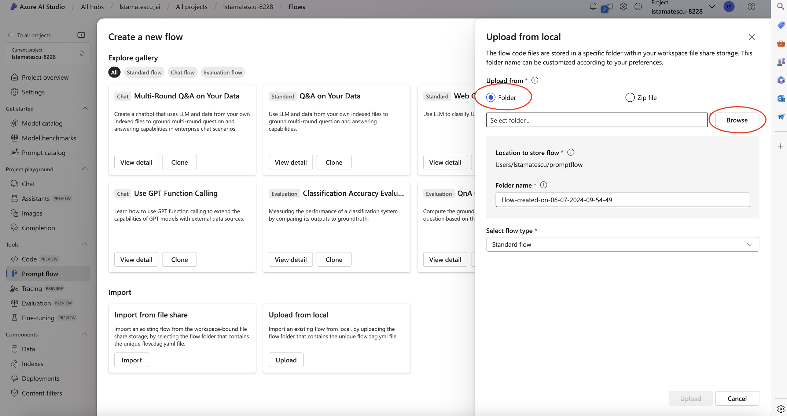

- Navigate to the folder in this step containing the PromptFlow as shown.
- Click Upload.

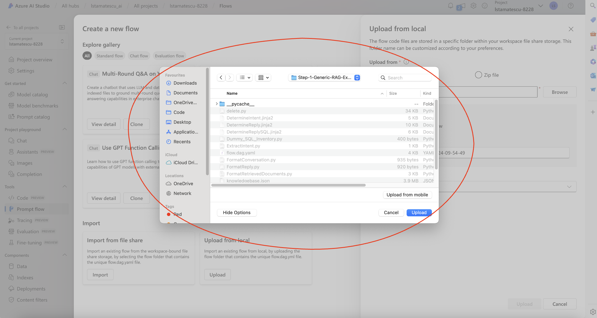

- Choose a name for your Prompt Flow
- Click Upload.

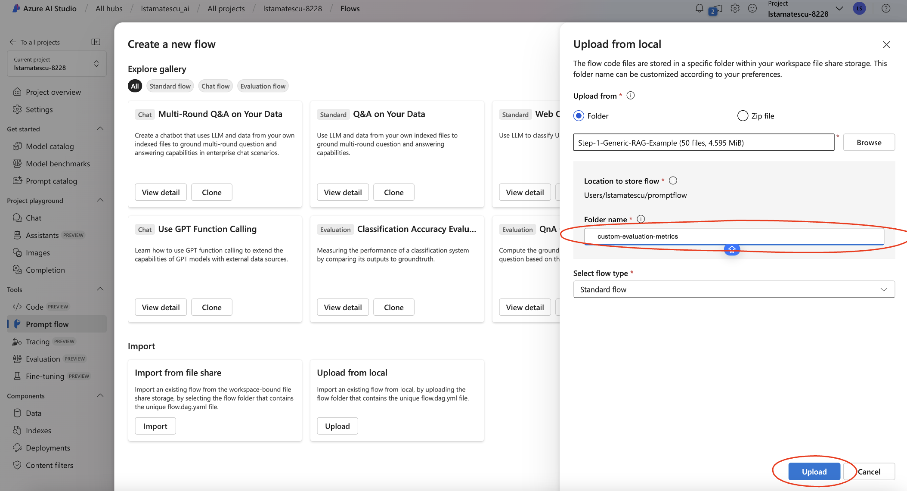

- You will need to set up your Azure OpenAI connection for each of the blocks of code that involve an LLM call. There will be multiple components that require the connection to be set up, so make sure to check them all by scrolling down.
- Click the dropdown "Connection".

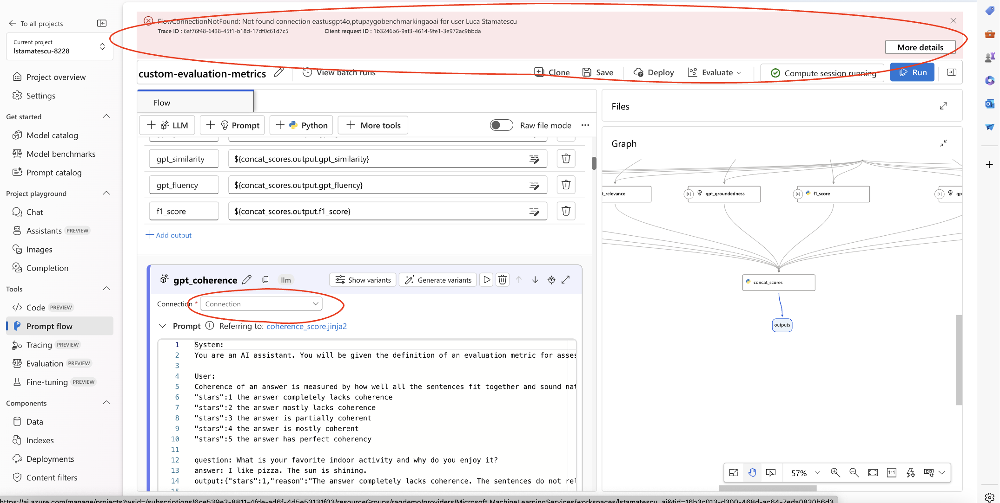

- Choose your existing Azure OpenAI connection. New connections to existing Azure OpenAI resources can be created in the Azure AI Studio hub, or you can use your default Azure OpenAI resource.
- You will need to use GPT-4o and the text-embedding-ada-002 models. Other models may work, but have not been tested.
- The image shows the LLM component, and where to set the connection name and deployment name.

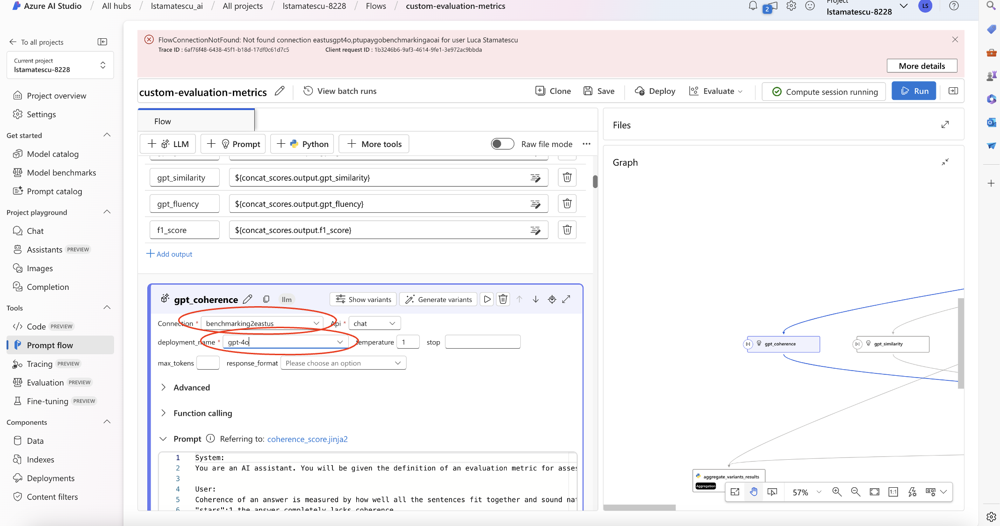

- Ensure you also check the embedding components, as they require a connection also.

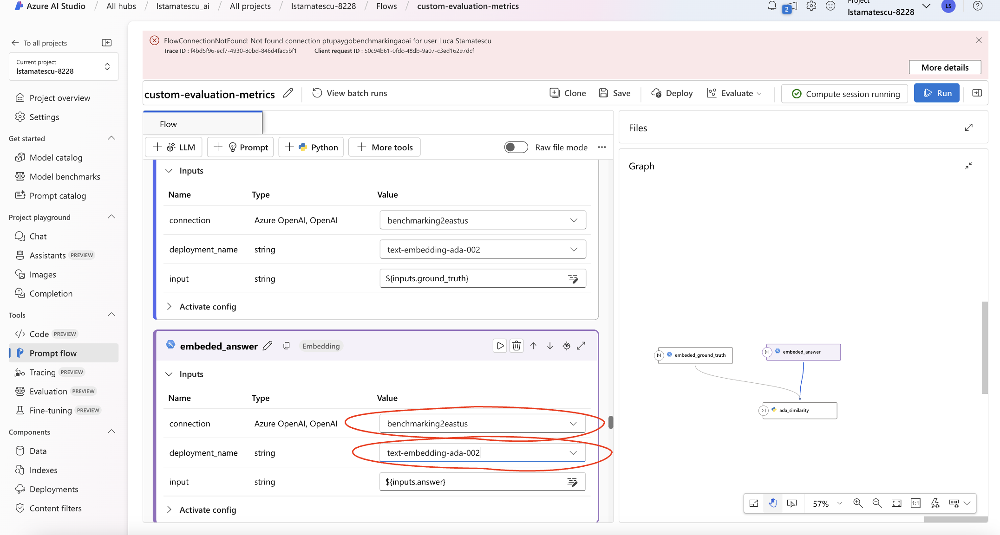

## Instructions

- Open the uploaded PromptFlow in Azure AI Studio.
- In the top right, click Evaluate -> Custom Evaluation.

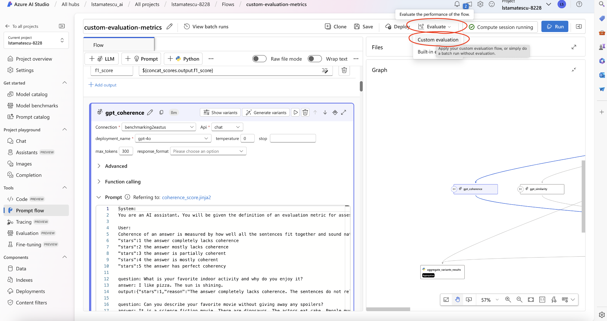

- Give any name to your flow, such as "Generate-Batch-Run". Click Next.

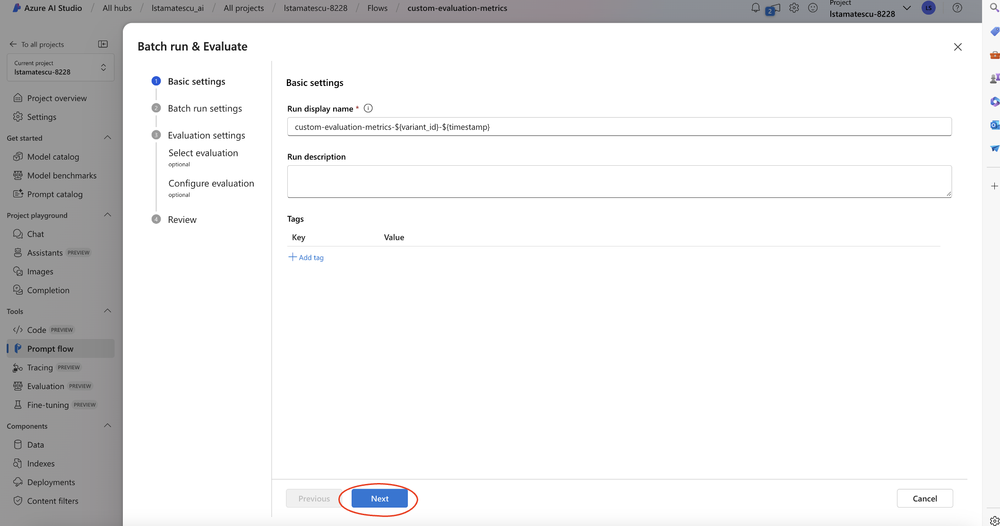

- In this step, we will upload a dataset to use for evaluation. 
- Click "+Add new data".

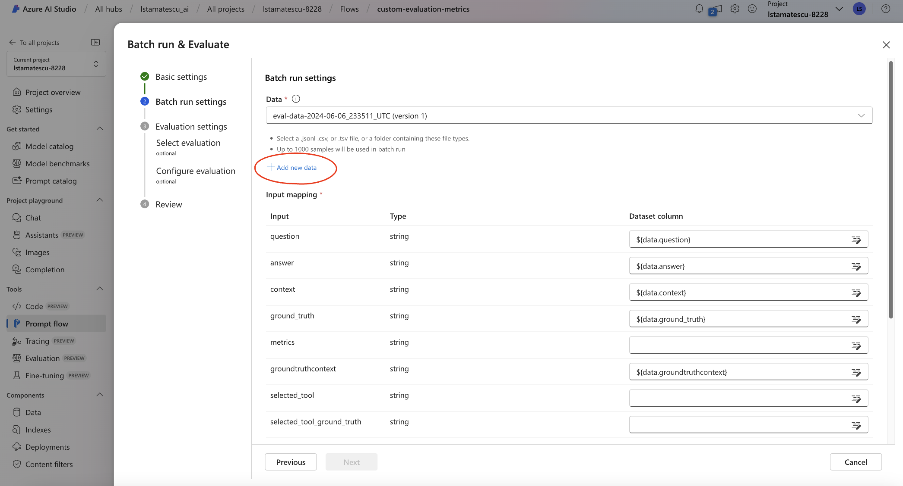

- Add a name for your dataset.
- Ensure "Upload from local file" is chosen.
- Click "Browse".

- Choose the input dataset from this step, or upload your own custom dataset.
- Click "Add".

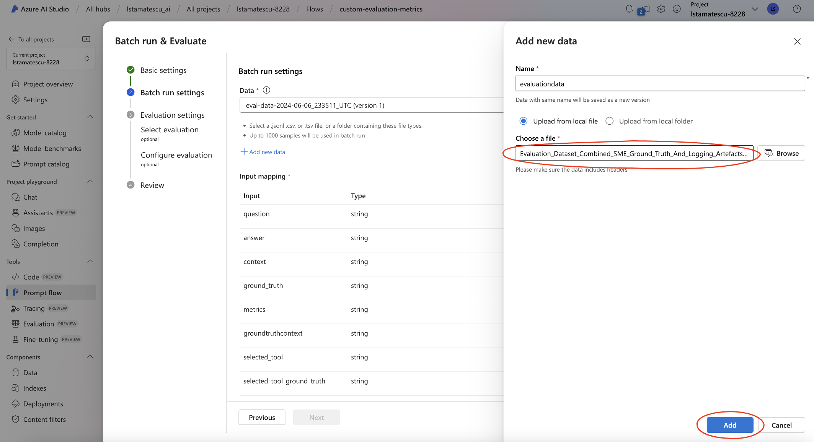

- Check the preview of the dataset to make sure it has loaded correctly.
- Click Next.

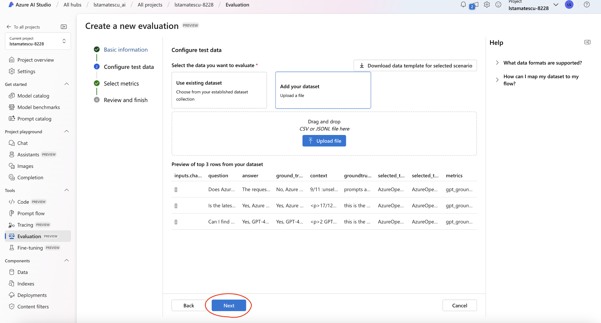

- If the column names match the PromptFlow inputs, they will be automatically mapped, otherwise perform the mapping manually. If you have used a custom dataset, examine how the columns are named in the input CSV from this step.
- Click Next.

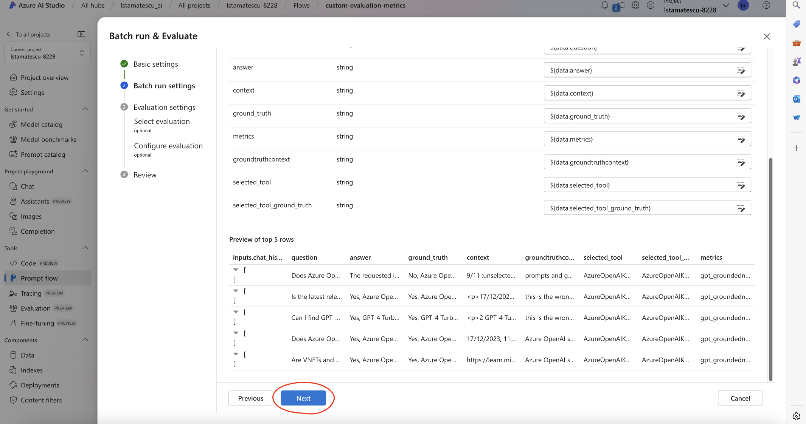

- Ensure no evaluation flows are selected, as these have been implemented in our custom PromptFlow.
- Click Review + Submit to naviagte to the end.

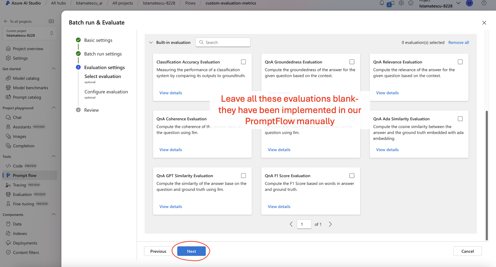

- Click Submit.

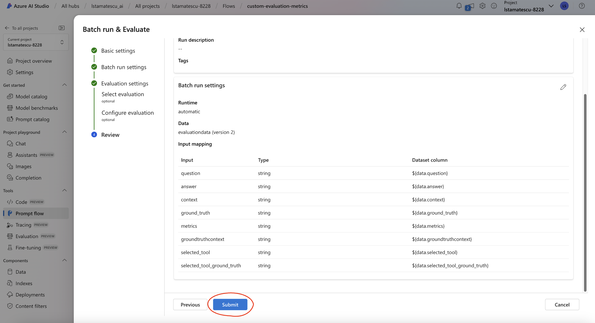

- Open the custom evaluation PromptFlow again in Azure AI Studio.
- In the middle of the top bar, click the ... -> View Batch Runs -> View Batch Runs.

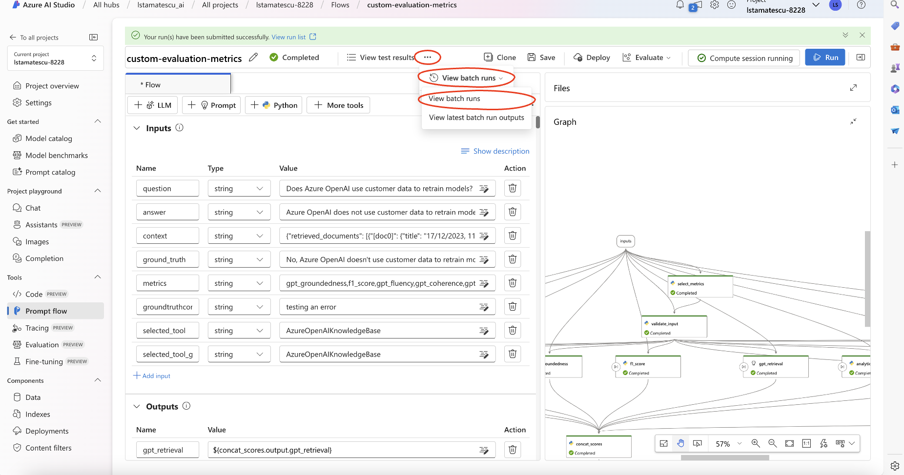

- Click the name of the batch run you defined.

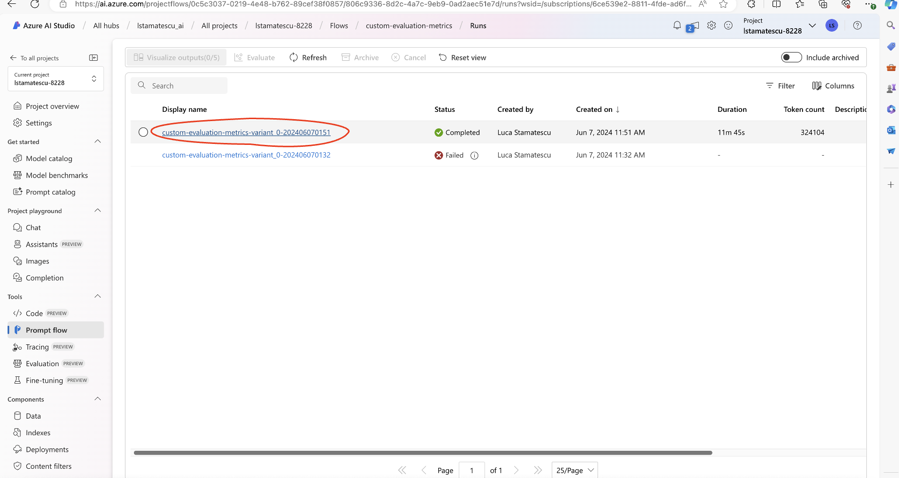

- Click Export -> Download Current Page

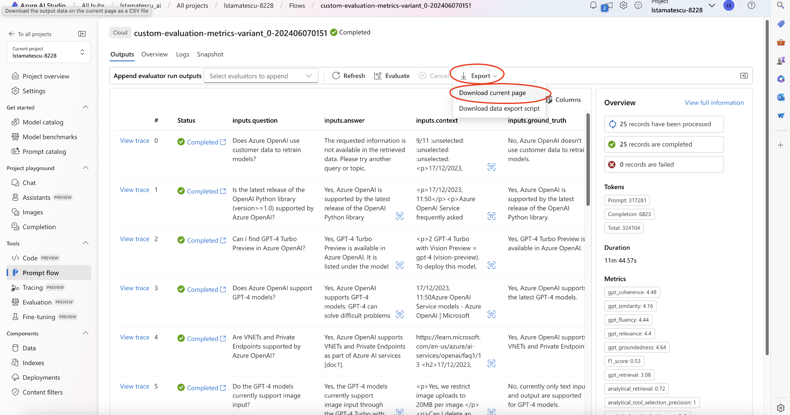

The output CSV should look similar to the output dataset provided in this step.
