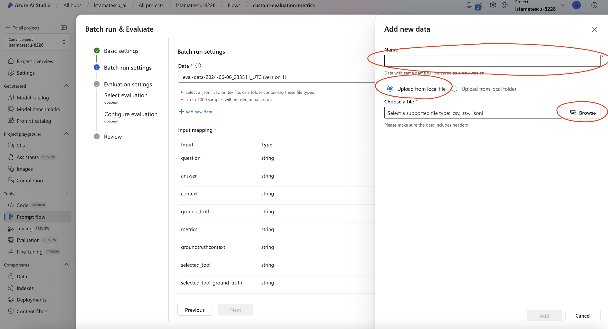

# Custom Evaluation Metrics with PromptFlow and Azure AI Studio

## Overview

This part of the workshop shows how to implement custom LLM evaluation metrics. In this step, we go beyond the default metrics, adding in:
- The ability to add a "reason" field, which allows developers to understand the LLMs reason for giving a specific score. This is helpful for debugging and improving the application.
- Additional evaluation metrics, such as the tool_selection and GPT_retrieval/analytical_retrieval metrics. These extend the evaluation capability, providing a confusion matrix for actions the LLM takes, such as deciding what tool to call (e.g. a knowledge base vs a SQL database) as well as metrics to evaluate the performance of the retrieval tasks (determining whether the retrieved documents match the ground truth documents).

## Where do the metrics used in this Prompt Flow come from?

When using Azure AI Studio, the evaluators are managed for you. You can find additional information about how these evaluations are defined here:
https://learn.microsoft.com/en-us/azure/ai-studio/concepts/evaluation-metrics-built-in?tabs=warning

Performing evaluations is also possible with the Prompt Flow SDK directly, providing a reduced set of metrics:
https://learn.microsoft.com/en-us/azure/ai-studio/how-to/develop/flow-evaluate-sdk

When developing the custom metrics for this step, the prompts used within the promptflow-evals package have been leveraged and then modified. You can view these within the package itself. For example, to view the prompt used for the groundedness evaluator, you can find it here: <your-location>/.venv/lib/python3.11/site-packages/promptflow/evals/evaluators/_groundedness/groundedness.prompty

## (Optional) Developing new metrics

You may wish to extend the default set of metrics by developing your own, specific to your application's or organization's needs. A few additional metrics have been added to the included Prompt Flow to illustrate this process.

An example of a new analytical metric is the tool_selection metric. This is defined in the "analytical_tool_selection.py" file. It is extremely simple- it determines whether the tool chosen by the application (in this case, the knowledge base or the SQL database) was correct. It compares two data points, the tool that _was chosen_ by the application, and the ground truth label of what tool the application _should_ have chosen. In the "aggregate_variants_results.py" step, these results are aggregated, and other metrics such as accuracy, precision, recall and F1 score can be calculated for the tool_selection step.

An example of a new LLM evaluator is the "gpt_retrieval" evaluator. As part of the dataset developed for testing, a label called groundtruthcontext was included, which is the sentence fragment that contains the information from the knowledge base or SQL database that is expected to be retrieved. This evaluator is used to determine to what extent the groundtruthcontext was found in the context that was retrieved by the GenAI application, and can help diagnose failures relating to the information retrieval step. There is also an analytical relevance metric ("binary_retrieval_metric.py"). The LLM evaluator is useful for a fuzzy match, whereas the analytical metric is checking for an exact match.

You are encouraged to consider what additional metrics might apply to your application, and add them to the evaluators.

## (Optional) Tuning existing metrics with few-shot prompting

LLM evaluators are simply an LLM prompt, using few-shot prompting to guide the LLM on how to generate scores for the different evaluation metrics. 

These few-shot examples are generic, and vary from topics such as ribosomes through to the titanic. The generic examples will often generate acceptable quality evaluations for a wide range of use cases, however you may wish to modify them to be more representative of your use case.

In the Output folder for this step ("gpt_similarity_prompt_tuned_few_shot_prompting.jinja2"), you are able to see an example that has been tuned for this scenario. 5 examples have been created, showcasing different levels of similarity, using questions and predicted responses about Azure OpenAI models.

These examples can either be hand-written, or generated using an LLM. The prompt used to generate these examples has been shared ("prompt-for-generating-few-shot-examples.txt").

You are encouraged to modify the few-shot prompting across any or all the included evaluators, however this step is optional, and can be left until later, when you are looking to optimize your evaluation flows.

## Pre-work

The datasets created by the SME and the Artefact Logging steps should be combined. An example template CSV is included in this step, to show what the input should look like. The headings used in the input template are important, as they will allow the columns to be automatically mapped to the right input. This can be done when running the evaluation manually, but this approach is much simpler to manage.

## Setup

- Select "Prompt Flow" in the sidebar.
- Click "+ Create".

- Scroll down to see "Upload from local".
- Click Upload.

- Ensure Folder is selected.
- Click Browse.

- Navigate to the folder in this step containing the PromptFlow as shown.
- Click Upload.

- Choose a name for your Prompt Flow
- Click Upload.

- You will need to set up your Azure OpenAI connection for each of the blocks of code that involve an LLM call. There will be multiple components that require the connection to be set up, so make sure to check them all by scrolling down.
- Click the dropdown "Connection".

- Choose your existing Azure OpenAI connection. New connections to existing Azure OpenAI resources can be created in the Azure AI Studio hub, or you can use your default Azure OpenAI resource.
- You will need to use GPT-4o and the text-embedding-ada-002 models. Other models may work, but have not been tested.
- The image shows the LLM component, and where to set the connection name and deployment name.

- Ensure you also check the embedding components, as they require a connection also.

## Instructions

- Open the uploaded PromptFlow in Azure AI Studio.
- In the top right, click Evaluate -> Custom Evaluation.

- Give any name to your flow, such as "Generate-Batch-Run". Click Next.

- In this step, we will upload a dataset to use for evaluation. 
- Click "+Add new data".

- Add a name for your dataset.
- Ensure "Upload from local file" is chosen.
- Click "Browse".

- Choose the input dataset from this step, or upload your own custom dataset.
- Click "Add".

- Check the preview of the dataset to make sure it has loaded correctly.
- Click Next.

- If the column names match the PromptFlow inputs, they will be automatically mapped, otherwise perform the mapping manually. If you have used a custom dataset, examine how the columns are named in the input CSV from this step.
- Click Next.

- Ensure no evaluation flows are selected, as these have been implemented in our custom PromptFlow.
- Click Review + Submit to naviagte to the end.

- Click Submit.

- Open the custom evaluation PromptFlow again in Azure AI Studio.
- In the middle of the top bar, click the ... -> View Batch Runs -> View Batch Runs.

- Click the name of the batch run you defined.

- Click Export -> Download Current Page

The output CSV should look similar to the output dataset provided in this step.

