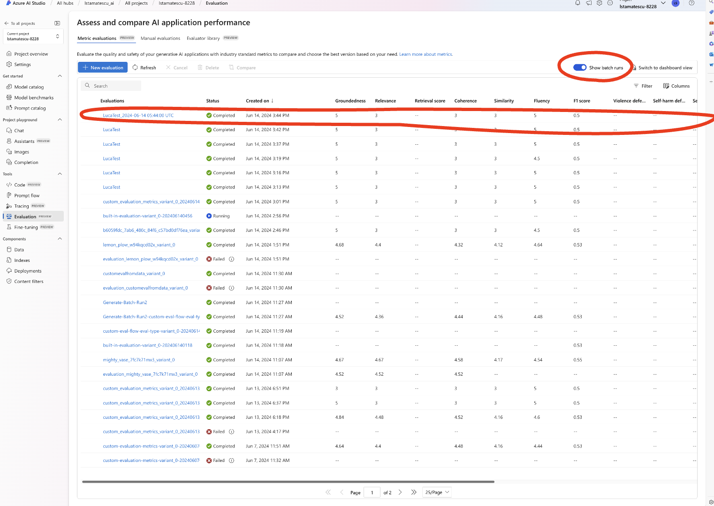
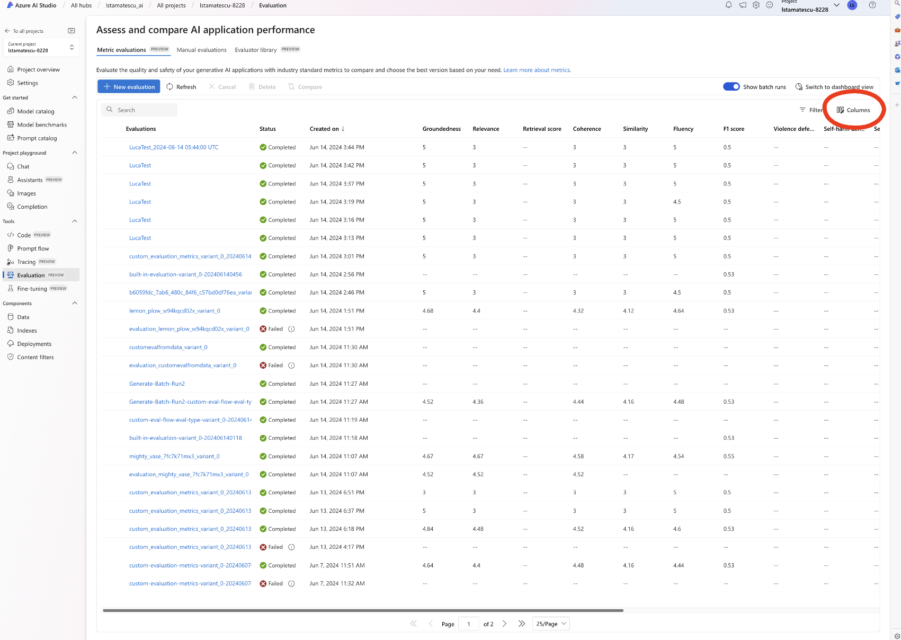
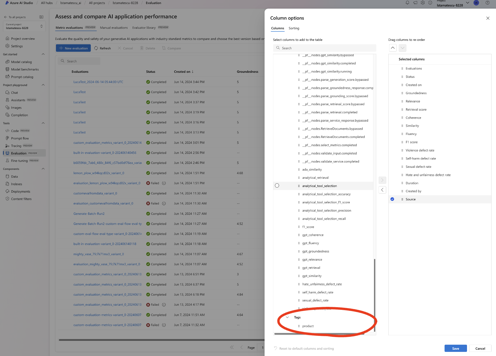
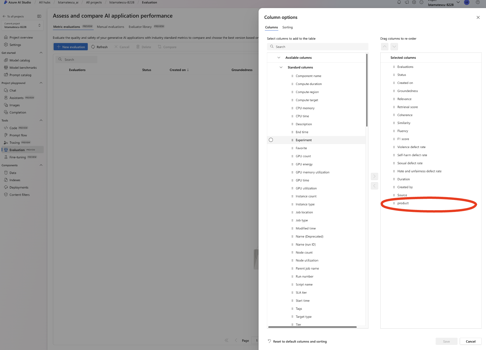
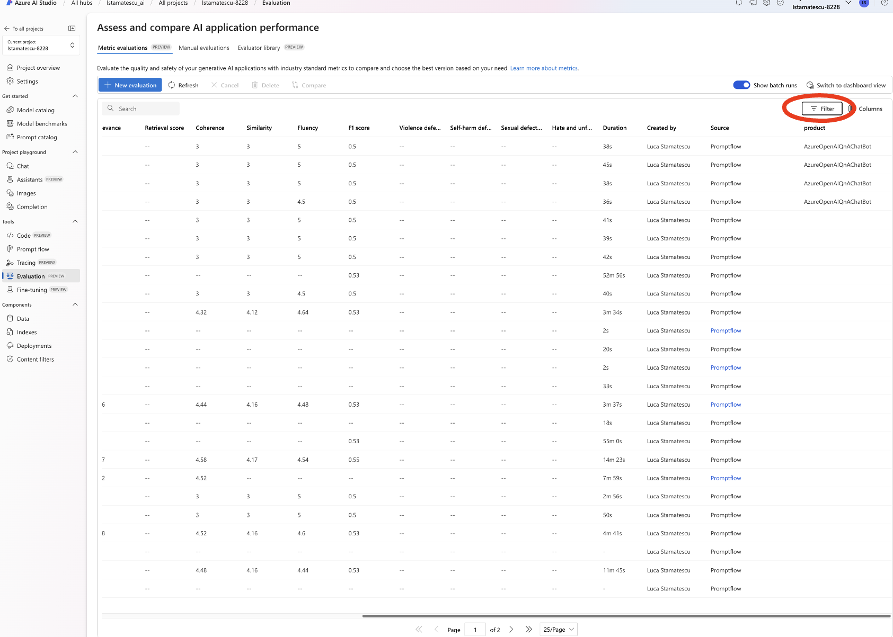
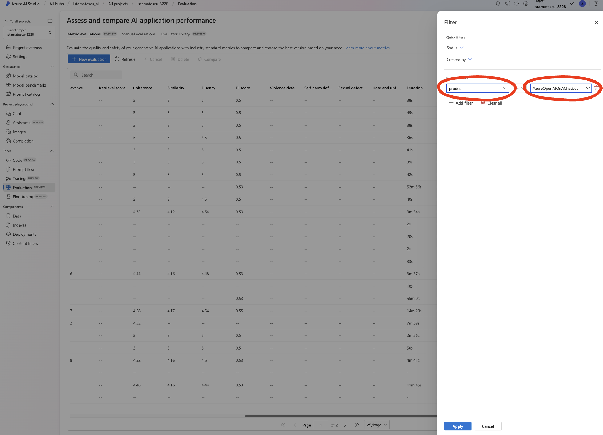
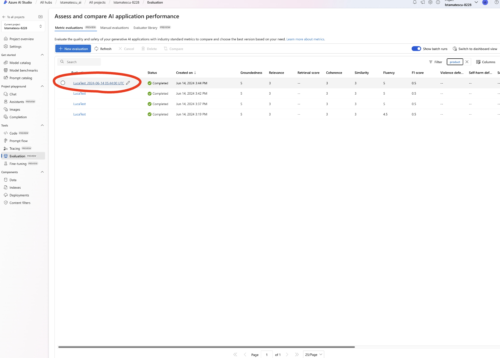
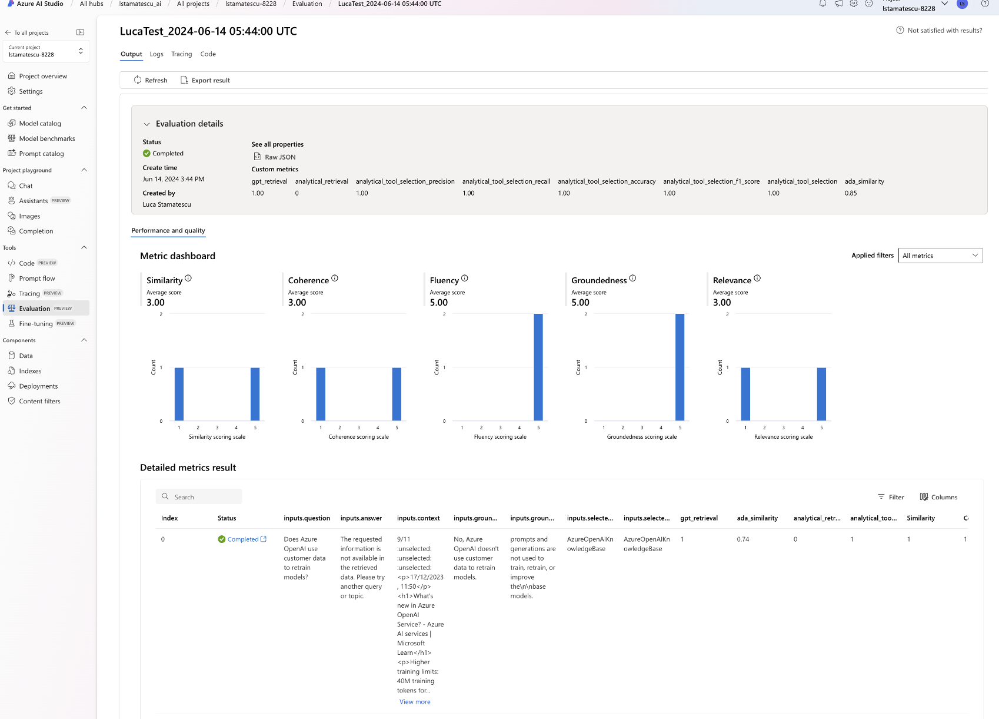

# CICD, Local Development And Logging Results Back To Azure AI Studio

## Overview

When working in your local environment, evaluation flows can be run, and results logged back to Azure AI Studio. This helps teams track their experiments throughout the development process, and determine whether changes made to the application have improved the application, or decreased performance.

Furthermore, when running CICD pipelines, you may wish for the deployment of your GenAI application to fail if certain quality or LLM evaluation metric thresholds are not met. This section shows the key commands for interacting with Azure AI Studio, to run these evaluations, store the results, and leverage them in your CICD pipeline. This workshop is only an introduction to the broader world of LLMOps; for a deep dive, explore this repository (https://github.com/microsoft/llmops-promptflow-template).

## Setup

- Rename the .env_sample file to .env
- Ensure you have added your WORKSPACE_NAME and RESOURCE_GROUP values to the .env.

## (Optional) Pre-work

This is not required for this step- these steps are included simply to highlight how GenAI developers iterate, evaluate and log results.

- (Optional) Make a change to the sample GenAI application PromptFlow provided, for generating testing artefacts. For example, modify the system prompt, change the model version, or add additional data to the Dummy SQL or knowledgebase. This is so that the testing artefacts (such as the model's response) are slightly different to before.
- (Optional) Generate testing artefacts, as done before in the earlier steps.
- (Optional) Merge the generated testing artefacts with the ground truth dataset
- (Optional) Use this new evaluation dataset for the remaining steps. Alternatively, use the same evaluation dataset used in previous steps.

## Instructions for Local Development

- Open the Jupyter Notebook ("5.1-logging-results-to-Azure-AI-Studio.ipynb") and run the cell.

After running the code cell, complete the following steps in Azure AI Studio.

- Open the Evaluations section in the sidebar. Ensure "Show Batch Runs" is toggled on.
- You should see your evaluation flow.

- In order to view the tags associated with an evaluation run, the tags column needs to be added to the view.
- Click Columns.

- Scroll down and locate the tag "products". Tags are key value pairs- for this example, we have defined this to be product:AzureOpenAIChatBot. A different product might look like product:HRBot.

- Click and drag the products option to the right column.

- Next we want to filter only on the products we are interested in.
- Click Filter.

- Select the "product" tag and type in the product name "AzureOpenAIChatBot".

- You should now be able to see only your filtered results.

- Click on the run to view the results.

